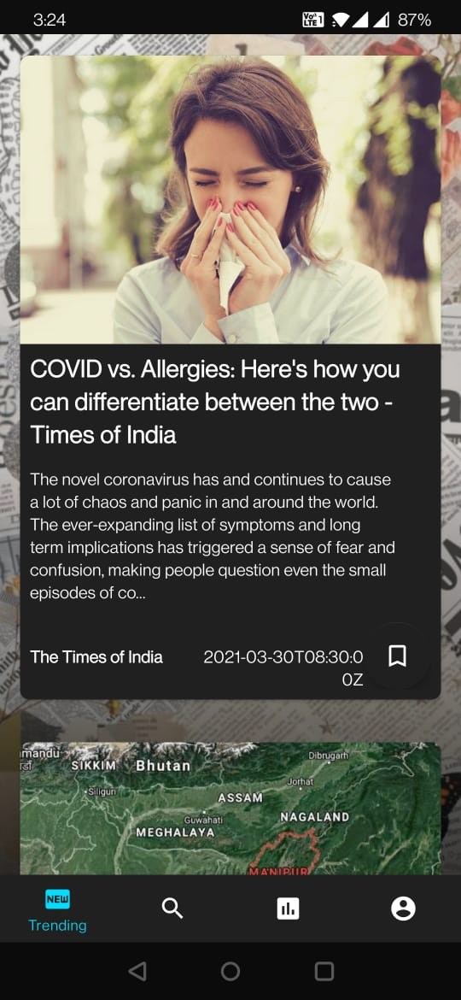
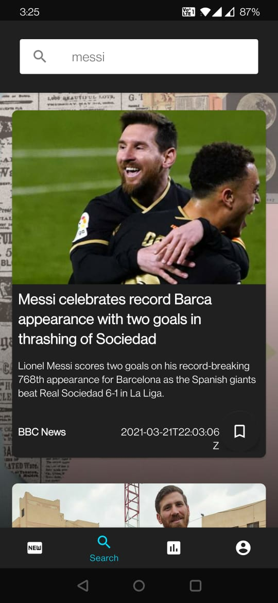
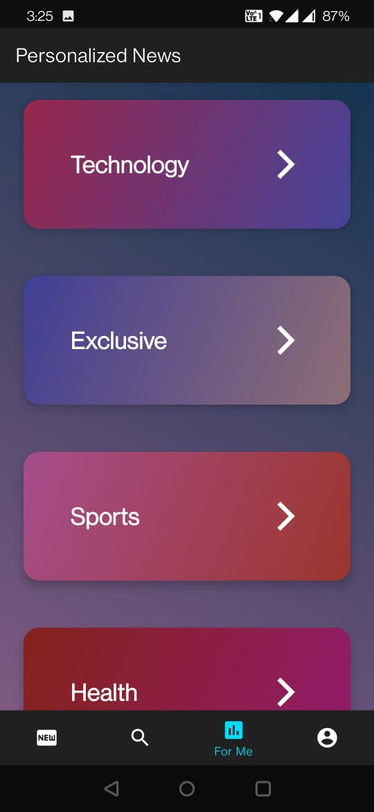
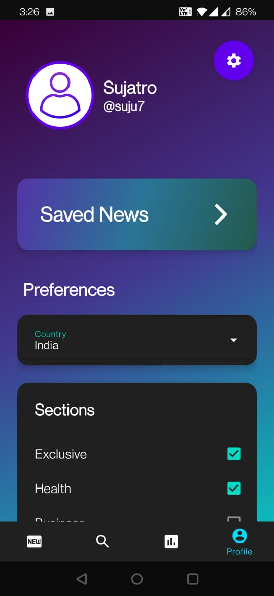
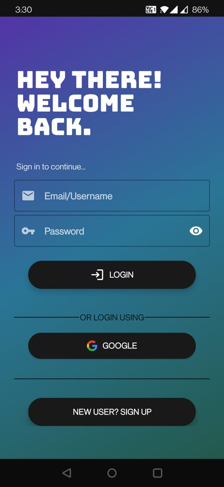
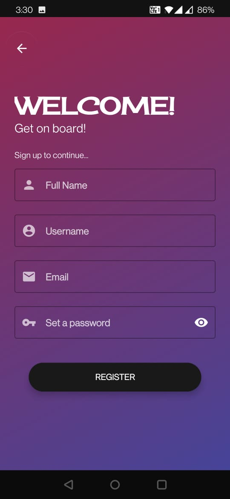
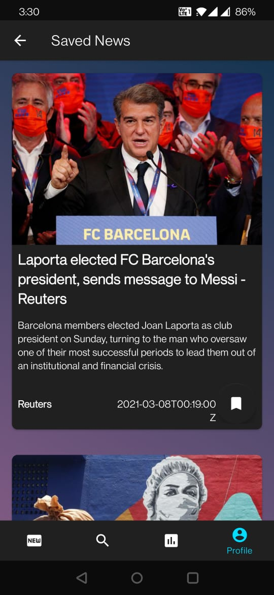
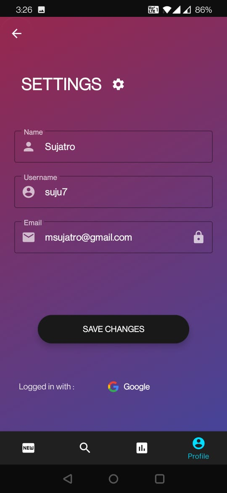
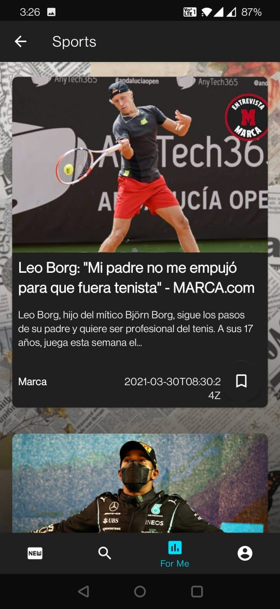

# What's On News App

## Introduction

This app brings fresh, daily news to its users. They can customize their preferences such as news topics they like and the country they choose. They can search for news with keywords. They are also free to bookmark their favourite news articles, and revisit them later. 

The app uses [Firebase](https://firebase.google.com/docs/guides) products for backend and [Retrofit](https://square.github.io/retrofit/) client for making HTTP requests to [News API](https://newsapi.org/).
Google's recommended [MVVM architecture](https://youtu.be/_T4zjIEkGOM?t=97), [Android Jetpack libraries](https://developer.android.com/jetpack#architecture-components) and [Material Design](https://material.io/develop/android) have been used for following best practices and providing the best user experience.

**You can try out the app by installing <a href="app/src/main/res/apk/app-debug.apk" download>this APK</a>.** *(It does not contain any malicious code, of course.)*
  

## Workflow 

- The user login (or signs up for an account) and his credentials, preferences, etc. are stored in Firebase. Firebase Authentication and RTDB are used for this purpose.
- This brings the user to the Trending News tab (where breaking news for the chosen country is displayed).
- The other tabs are Search Tab, Personalized News Tab and Profile Tab.
- The user can choose preferred news section from Profile Tab (currently, there these seven topics are covered: Exclusive, Health, Business, Entertainment, Sports and Technology). These sections can be visited from the Personalized (For Me) Tab *.
- News Search is supported from the Search Tab. Try to be concise as using many keywords together might not fetch any result.
- User can bookmark any news they find interesting. They can revisit them from the Saved News section in the Profile Tab.
- Each news opens up in a web view format when clicked to show a more detailed content.

Note: *The user may find news in different languages sometimes under topics in the Personalized (For Me) and Search News sections. This is because I'm using a free tier from News Api.*
 
 
 

## Screenshots
 

- **Tabs**

 || |
|:-:|:-:|:-:|:-:|
|**Trending Tab**|**Search Tab**|**Personalized Tab**|**Profile Tab**|

 

- **Login and Sign up**

 | |
|:-:|:-:|
|**Login**|**SignUp**|

 

- **Screenshots of Other Fragments**

 | |
|:-:|:-:|:-:|
|**Profile -> Saved News (Bookmarked Articles)**|**Profile -> Settings**|**Personalized -> Particular Section**|

  

## Future development ideas...

Here are some thoughts on further improving the app. (You are also welcome to fork this project and experiment with it.)
- Building a community of readers who can discuss about these news articles among themselves. This can provide a healthy debate about fresh topics they encounter.
- A journalist section for enthusiasts who are willing to pitch in about events from their zone. Also, keeping score of these folks through a star-based system to ensure the credibility of the news they deliver.
